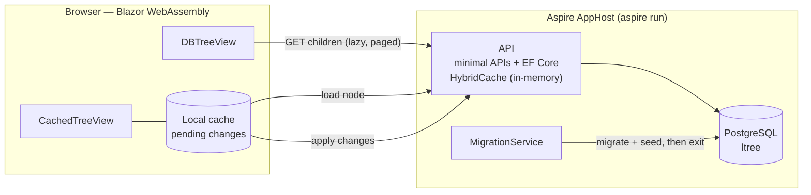
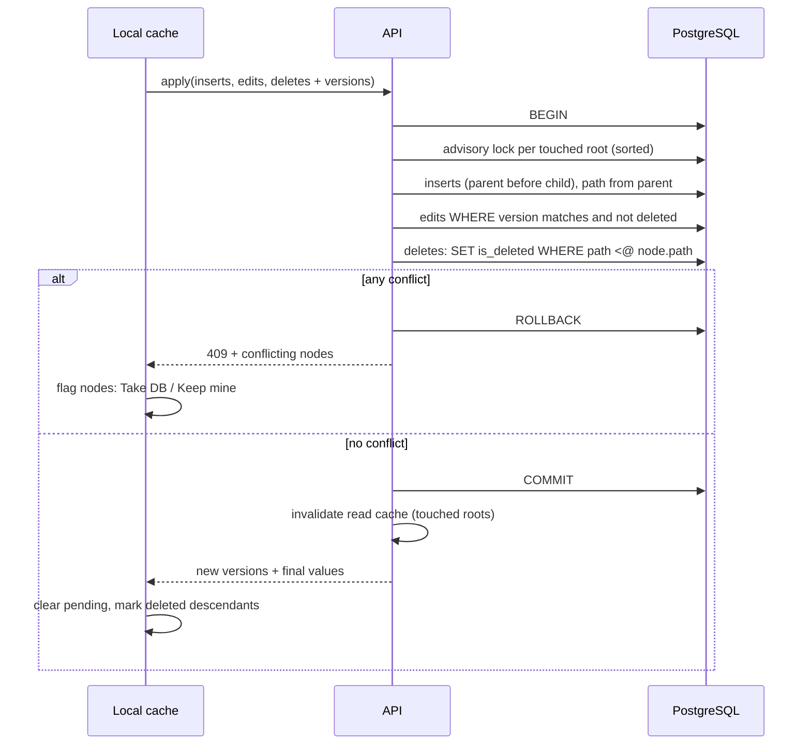

# Decisions

Product and technical decisions for the tree editor take-home assignment.
The assignment author is not reachable, so every ambiguity below was decided by the PO (grill session, 2026-09-30).
Each decision lists **why**, and what was rejected.

## Overview



The local cache talks to the API through exactly two calls: **load node** and **apply**. Everything else happens in the browser.

## Stack

**.NET 10 + Aspire 13, started with `aspire run`.**
- Why: the vacancy requires hands-on Aspire. Aspire 13 needs the .NET 10 SDK, and .NET 10 is LTS (.NET 9 support ends Nov 2026). One command starts database, migrations, API and UI, which covers the README requirement. The Aspire dashboard gives logs and traces for free.
- Rejected: docker-compose — extra files, no dashboard, and doesn't show Aspire.

**PostgreSQL.**
- Why: a relational DB is required. `ltree` is a native path type with indexed ancestor/descendant operators, which is exactly what a big tree with cascading deletes needs. Aspire has a first-class Postgres integration.
- Rejected: SQL Server (`hierarchyid` works, but heavier container), SQLite (no path type, weak concurrency).

**Blazor WebAssembly, served by the API.**
- Why: the hardest logic lives in the cache (placeholders, cascade in cache, conflicts). In Blazor it's C#, unit-tested with xUnit like the backend, and DTOs are shared with the API. The reviewer needs only the .NET SDK and Docker. WebAssembly keeps the cache in the browser. Serving it from the API means same origin: no CORS, no service-discovery setup inside the browser.
- Rejected: React (needs Node, types duplicated in TypeScript), Blazor Server (the cache would live on the server, in the circuit).

**MudBlazor for dialogs, snackbars, buttons; custom tree components.**
- Why: ready UI pieces save time. The trees are custom because placeholders and state markers (pending, deleted, conflict) are not standard tree features.

## Data model

| Column      | Type           | Notes                                                        |
|-------------|----------------|--------------------------------------------------------------|
| `id`        | `uuid`         | GUID v7. Generated by the client for new nodes; final at creation. |
| `parent_id` | `uuid` null    | FK to `id`. `null` = root. Multiple roots allowed.           |
| `path`      | `ltree`        | Ancestor ids + own id. Computed by the server from the parent's path, never trusted from the client. GiST index. |
| `value`     | `varchar(255)` | Trimmed, required.                                           |
| `is_deleted`| `bool`         | Soft delete.                                                 |
| `xmin`      | system column  | Optimistic concurrency token.                                |

**`parent_id` + `ltree` path (adjacency list + materialized path).**
- Why: parent–child links never change (assignment), so a path is written once and never rewritten — the usual weakness of materialized paths disappears. `path <@ X` selects a whole subtree in one indexed query, so a delete cascades to descendants that were never loaded. The path also gives a node's ancestors with no extra query, which the placeholders need. `parent_id` serves "children of X" for DBTreeView through a btree index on `(parent_id, lower(value), id)`, which also gives the sort order for paging.
- Trade-off: moving a node would mean rewriting the path of the node and its whole subtree (plus a cycle check). The assignment forbids moves, so this cost is never paid.
- Rejected: adjacency list + recursive CTE only (every cascade and ancestor lookup is recursive raw SQL), nested sets (an insert shifts large parts of the table), closure table (an extra table with one row per ancestor pair).

**GUID v7 ids.**
- Why: new nodes get their final id in the cache, so Apply needs no temp-id mapping and the cache never re-keys nodes, children or UI state after Apply — that mapping is where most cache bugs would live. A retry can't create duplicate rows. v7 is time-ordered, so no index fragmentation like random v4.
- Cost: longer `ltree` paths, less readable ids when debugging.
- Rejected: `bigint` (short, readable, but needs temp ids and the mapping step).

**Soft delete (`is_deleted`).**
- Why: the assignment says deleted elements are "marked as deleted". DBTreeView can show the result of a cascade. Apply can tell "deleted by someone" apart from "never existed".
- Rejected: hard delete (nothing to show, and a conflict looks like a missing row).

**`xmin` as the version token.**
- Why: Postgres changes it on every row update automatically — no extra column or trigger — and EF Core's Npgsql provider supports it as a concurrency token.

**Unique sibling names: `UNIQUE (parent_id, lower(value)) NULLS NOT DISTINCT WHERE NOT is_deleted`.**
- Why: the PO wants no duplicate names on the same level. Only a DB index holds under concurrent Applies. `lower()` makes it case-insensitive. `NULLS NOT DISTINCT` stops two roots from sharing a name (roots have a `null` parent). The `WHERE` clause lets deleted nodes free their name. Because it skips deleted rows, it can't serve DBTreeView (which lists deleted nodes too) — hence the separate `(parent_id, lower(value), id)` index.

**Value: trimmed, required, max 255.**
- Why: empty names are unreadable in a tree; a bound keeps the index and UI sane.

## DBTreeView

**Lazy, one level per expand; each child carries `hasChildren`.**
- Why: the assignment forbids loading the whole tree. One level is the minimum unit. `hasChildren` is computed in the same query (`EXISTS`), so there are no empty expand arrows and no extra query per node.

**Children sorted alphabetically (case-insensitive), ties broken by `id`.**
- Why: paging needs a stable order, and alphabetical is what a user expects in a tree. `id` separates a live node from deleted namesakes.
- Rejected: creation order (GUID v7 is time-ordered, but the order means nothing to the user).

**Wide nodes paged: a "Load more" row fetches the next 100 children (keyset paging on `(lower(value), id)`).**

```
▾ Europe
  ▸ Albania
  ▸ Andorra
  … 98 more
  ⤓ Load 100 more
```

- Why: the seed has nodes with 10k children; fetching and rendering them at once contradicts "too large to load". Keyset paging stays fast deep into the list, where `OFFSET` gets slower with every page. The server reads 101 rows to know whether more exist, so there's no count query.
- Rejected: range buckets like `[1–100]` (fake tree levels, needs `OFFSET` and a count), loading all children with virtualized rendering (breaks on very wide nodes).

**Deleted nodes shown greyed and struck through.**
- Why: the reviewer can see that a delete reached descendants that were never loaded.

**"Load into cache" disabled for deleted and already-cached nodes.**
- Why: deleted nodes can't be edited (assignment), so there's nothing to do with them in the cache. Reloading a cached node could overwrite its pending edits.

## CachedTreeView (local cache)

**Lives in the browser; the API is stateless.**
- Why: "local cache" plus the rule ("the cache may access the database only when loading an element or applying changes") means the cache is a separate layer with exactly two DB calls. In the browser that boundary is enforced by design. Edits are instant, with no round trip.
- Rejected: a server-side cache per user — needs sessions, memory, expiry, is lost on restart, and Reset would have to wipe every session.

**Missing ancestors shown as placeholder nodes.**

Cache holds Root A and C; C's path is `A.B.C`; B is not loaded:

```
Cache holds A and C           After B is loaded
▾ Root A                      ▾ Root A
  ▾ … (not loaded)              ▾ B
      C                             C
```

- Why: the assignment requires related elements to appear "in the correct hierarchy". Placeholders keep every node at its exact depth without claiming a false parent, and satisfy both readings of "related" (direct parent or any ancestor). This is the same pattern AG Grid calls "filler groups". Placeholders can't be selected and have no actions.
- Rejected: showing C directly under A with a gap marker (depth unclear), showing C as a separate root (fails if the reviewer loads a root and a grandchild), auto-loading missing ancestors (breaks "loaded individually").

**Consecutive missing ancestors collapse into one placeholder row with a count.**

```
Cache holds Root A and X (depth 200)
▾ Root A
  ▾ … 198 levels not loaded
      X
```

- Why: one row per missing level would show 198 identical rows. The count keeps the depth visible. Loading an ancestor inside the gap splits the row around it.

**Delete in cache marks every cached descendant deleted (found via paths) and drops their pending edits.**
- Why: paths reveal descendants even when they sit under placeholders, so the cache never keeps editable nodes inside a deleted subtree. Deleting an unsaved node simply removes it — it never existed in the DB.

**Adding a child under an unsaved node is allowed.**
- Why: building a small subtree before Apply is natural; GUID ids make it cheap.

**Local ` (n)` suffix for duplicate sibling names.**
- Why: instant feedback. The server has the final say, because the cache can't see siblings that were never loaded.

**"Discard all changes" button; warning before leaving the page; nothing persisted across refresh.**
- Why: pending changes exist only in memory, so the user must not lose them silently. Persisting them (e.g. in localStorage) would bring back versions that may be hours old, which guarantees conflicts.

## Apply



**One transaction, all-or-nothing.**
- Why: a partial success leaves the cache and the DB half in sync, which is hard to show and hard to test.
- Rejected: saving the non-conflicting part and reporting the rest.

**Order: inserts → edits → deletes.**
- Why: inserts go parent before child so foreign keys hold; deletes run last so the cascade sees the final subtree.

**Optimistic concurrency.**
- Why: the cache can hold data for a long time, and a reviewer may open two tabs. A stale edit must never silently overwrite a newer one.
- Rejected: last write wins.

**Conflict rules.**
- Edit or delete of a node whose version changed → conflict. Why: someone else changed it after it was loaded.
- Any operation on a node already deleted in the DB → conflict; the local change is dropped and the node is marked deleted. Why: deleted elements must not come back (assignment).
- Add child only checks that the parent exists and isn't deleted. Why: a changed parent value doesn't affect its children.
- Insert with an id that already exists → rejected. Why: client-generated ids must be validated.

**Per-node resolution: Take DB or Keep mine.**
- Why: the user decides explicitly; no silent loss on either side. Keep mine rebases on the new version and applies again.

**Sibling name suffix decided on the server.**
- Why: only the server sees all siblings, including those never loaded. A colliding name gets the first free ` (n)` suffix, for renames too.

**Response: new versions and final values of changed nodes.**
- Why: that's all the cache needs to clear its pending state; it works out deleted descendants itself from paths.

**Apply button disabled while a request is in flight.**
- Why: a double click would send the same inserts twice; the second request would fail with "id already exists", which confuses the user.

## Concurrent Applies

The version check catches stale data. It does not catch two Applies whose transactions overlap in time.

```
t  Apply 1: delete X                         Apply 2: add Y under P (P inside X)
1                                             BEGIN; P not deleted ✓
2                                             INSERT Y (uncommitted)
3  BEGIN; UPDATE is_deleted WHERE path <@ X
   → doesn't see Y
4  COMMIT
5                                             COMMIT
=> X and P deleted, Y alive under a deleted parent
```

The same overlap lets two Applies add the same name under one parent: both pick the same suffix and one fails on the unique index.

**Applies on the same root tree run one at a time: a transaction-scoped Postgres advisory lock per touched root, taken in sorted order.**
- Why: removes both races with no retries and is easy to reason about and test. Applies on different roots still run in parallel. Sorted order prevents deadlocks. The lock is released on commit or rollback. The root of a node is the first label of its path.
- Roots are siblings of each other across trees, so an Apply that renames a root also takes one shared "roots" lock.
- Rejected: SERIALIZABLE + retry (aborts on false positives, retry loop hard to test), row locks on ancestor chains (subtle under READ COMMITTED — a running `UPDATE` doesn't see rows committed after it started — and deadlock-prone).

**Reset vs Apply: no extra locking.**
- Why: Reset truncates and reloads in one transaction. `TRUNCATE` takes an exclusive table lock, so it waits for running Applies and blocks new ones until it commits.

## Reset

**Confirm → truncate + copy from `seed_nodes` (one transaction) → clear browser cache and read cache → refresh DBTreeView.**
- Why: the stored seed makes the demo and the tests deterministic and Reset fast (see Seed data). Clearing both caches prevents stale reads. Other open tabs get conflicts on their next Apply, consistent with the concurrency rules. The confirmation protects against an accidental wipe.

## Backend read cache

**HybridCache, in-memory, for DBTreeView reads and node loads; tag per root; invalidated after commit.**
- Why: repeated expands and loads skip the DB; HybridCache adds stampede protection and tag-based invalidation. A tag per root is needed because a cascade makes an unknown number of child lists stale. Invalidating after commit keeps loads from returning old versions (which would cause false conflicts).
- Why in-memory: a single API instance; Redis would add a container for no gain. Scaling out later only needs Redis in the AppHost plus `AddRedisDistributedCache` — HybridCache then uses it as a second level with no code changes.

**Entries expire after 60 s.**
- Why: a read that started before an Apply committed can store old data after the invalidation. Writes stay correct thanks to the version check (worst case: a false conflict); the expiry bounds how long such an entry lives.
- Rejected: locking reads against Applies (slows every read to fix a rare, harmless race).

## Seed data

**Generated with Bogus from a fixed random seed: 100k nodes by default, configurable up to 1M.**
- Shape: 5 roots; most nodes have 0–20 children; a few have 5k–10k children; one chain is 200 levels deep; everything else is at most 12 levels deep. Names come from Bogus; sibling clashes get the ` (n)` suffix.
- Why: the assignment says the tree is "too large to load in full" — a hand-written sample of 60 nodes wouldn't prove it. Wide nodes exercise paging, the deep chain exercises placeholders, and depth far exceeds the required 4. The fixed seed produces the same tree (same ids) on every machine, so the README and tests can point at known nodes. 100k keeps the first start fast; 1M is there for a scale demo (setting documented in the README).
- Rejected: hand-written sample (too small), 1M always (slow first start).

**Generated once into a `seed_nodes` table with binary `COPY`; `nodes` is filled from it.**
- Why: EF `SaveChanges` is far too slow for 100k+ rows; binary `COPY` is the fastest bulk path. Paths are computed during generation. Reset becomes `TRUNCATE` + `INSERT … SELECT` inside Postgres instead of a regeneration. The MigrationService generates the table on first start and again when the size setting changes.
- Risk: a path 200 GUIDs deep is about 7 KB, close to Postgres's index row limit (about 8 KB). Checked early in the build; fallback: shorter labels (a GUID as 22-char base64url) or a shallower chain.

## Architecture

**Projects: AppHost, ServiceDefaults, MigrationService, Api, Domain, Contracts, Web, tests.**
- MigrationService: runs migrations and seed once, then exits; the API waits for it (`WaitForCompletion`). Why: the API never starts against an empty or half-migrated DB.
- Domain: pure tree rules (paths, cascade, suffixes, conflicts). Why: testable without a DB.
- Contracts: DTOs shared by Api and Web. Why: one definition, no drift.

**Light layering, not full clean architecture.**
- Why: about ten endpoints don't justify Domain/Application/Infrastructure/Api ceremony. The rules that matter still live in a pure Domain.

**ProblemDetails errors, built-in OpenAPI + Scalar UI.**
- Why: a standard error format (RFC 9457), and the reviewer can try the API without the UI.

## Tests

- xUnit unit tests for domain rules and cache logic. Why: fast, covers the trickiest logic.
- Integration tests with Testcontainers (PostgreSQL): Apply, cascade delete, conflicts, Reset, paging. Why: `ltree`, `xmin` and the partial unique index only behave correctly on real Postgres.
- Concurrency integration tests: parallel Applies (delete vs add child in the same subtree; the same new name under one parent) end in a consistent state. Why: the races above only show up under real parallel transactions.
- One smoke test with `Aspire.Hosting.Testing`. Why: proves the whole app starts, the way the reviewer will start it.

## Out of scope

Authentication, AI features, "add root" button, docker-compose fallback, persisting the cache across page refresh.
- Why: none of these is asked for by the assignment; each adds work without changing how the core behaviour is judged.
